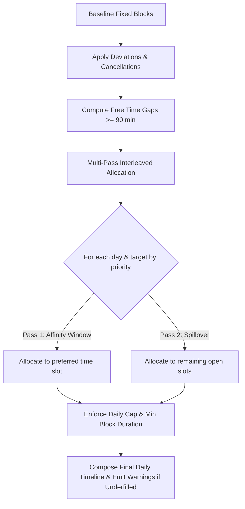

# Day-Date — Dynamic Scheduling Engine

A Flutter application implementing a dynamic weekly scheduling engine with **Clean Architecture**, **Riverpod** state management, and **Hive CE** local persistence. All data is stored locally offline with no network dependency.

---

## Tech Stack

| Layer | Technology |
|:------|:-----------|
| **Framework** | Flutter / Dart |
| **State Management** | Riverpod |
| **Local Storage** | Hive CE (Community Edition) |
| **Architecture** | Clean Architecture (Domain → Data → Application → Presentation) |
| **Testing** | flutter_test |

---

## Architecture Overview

```
lib/
├── core/
│   ├── constants/     # Schedule parameters, bounds, Hive box names
│   ├── error/         # Sealed failure hierarchy
│   └── utils/         # Time utilities (overlap checks, formatting, free slots)
│
├── features/
│   └── schedule/
│       ├── domain/
│       │   ├── entities/      # TimeBlock, TaskTarget, ScheduleDeviation
│       │   ├── repositories/  # Abstract ScheduleRepository interface
│       │   └── usecases/      # SeedInitialData, AddDeviation, GetWeeklySchedule
│       │
│       ├── data/
│       │   ├── models/        # Hive models + bidirectional entity mappers
│       │   ├── datasources/   # LocalScheduleDatasource (Hive CRUD + change streams)
│       │   └── repositories/  # ScheduleRepositoryImpl
│       │
│       ├── application/
│       │   ├── services/      # PlannerService (Bounded Interleaved Strategy)
│       │   └── providers/     # Riverpod reactive providers & streams
│       │
│       └── presentation/
│           ├── screens/       # Weekly overview, daily detail views
│           └── widgets/       # TimeBlockCard, DayColumn, AddDeviationSheet
│
├── hive_registrar.g.dart      # Generated Hive adapter registry
└── main.dart                  # Application bootstrap & initialization
```

---

## Core Concepts & Data Models

The engine balances rigid commitments with flexible weekly goals across a multi-day cycle.

### 1. `TimeBlock`
Represents an allocated time interval on a given day.
- **Fixed (`TimeBlockType.fixed`)**: Recurring commitments (e.g., classes, work, routine habits, commute buffers) that anchor the day.
- **Floating (`TimeBlockType.floating`)**: Dynamic study/work blocks placed by the scheduling engine to fulfill weekly targets.
- **Deviation (`TimeBlockType.deviation`)**: Temporary overrides such as blockouts, extended events, or leisure time.

### 2. `TaskTarget`
Represents a weekly goal with configurable constraints:
- **Weekly Quota (`weeklyHours`)**: Target total hours to distribute over the week.
- **Priority (`priority`)**: Lower number = higher allocation priority during conflict resolution.
- **Time Affinity (`TimeAffinity`)**: Preferred scheduling window (e.g., Morning, Afternoon, Late Night, or Flexible).
- **Daily Cap (`dailyCapHours`)**: Upper bound per single day to prevent clustering and cognitive fatigue.

### 3. `ScheduleDeviation`
User-reported deviations applied on top of the baseline schedule:
- **Blockout**: Marks a time span as unavailable, routing floating tasks to other free windows.
- **Extension**: Lengthens an existing fixed commitment and automatically shifts dependent buffers (e.g., commute).
- **Fixed Event Cancellation**: Removes recurring commitments for a specific date, triggering dynamic re-balancing.

---

## Scheduling Algorithm — Bounded Interleaved Strategy

The `PlannerService` distributes floating targets using a multi-pass constraint-satisfaction strategy:



### Key Algorithmic Rules
1. **Minimum Block Duration**: Floating blocks enforce a minimum chunk size (90 minutes) to eliminate fragmented, unproductive micro-slots.
2. **Daily Caps**: Prevents any single target from monopolizing an open day.
3. **Affinity Biasing**: Prioritizes time-of-day suitability (e.g., morning for high-focus study, afternoon/evening for projects) before falling back to spillover slots.
4. **Interleaved Distribution**: Allocations cycle across days and targets iteratively rather than greedily dumping all hours into the earliest day.

---

## Cancellation & Dynamic Re-Balancing System

When scheduled fixed commitments are cancelled on a specific date (e.g., sudden holidays, sick days, or schedule changes), the engine offers two re-balancing strategies:

### 1. `accelerateWeek` (Default)
- Removes the cancelled fixed blocks and associated commute buffers for that date.
- Opens the freed time to floating task targets following affinity and daily cap rules.
- As quotas are fulfilled earlier in the week, subsequent days and weekend requirements automatically scale down.

### 2. `restAndLeisure`
- Removes the fixed commitments for that date.
- Designates the opened duration as unallocated free/leisure time.
- Preserves the standard schedule for the remainder of the week without pulling work forward.

### Calendar Date Awareness
Deviations and cancellations support specific `DateTime` timestamps, allowing targeted overrides on specific calendar dates while preserving the underlying weekly baseline template.

---

## Running the App

```bash
# Get dependencies
flutter pub get

# Generate Hive adapters & Riverpod code
dart run build_runner build --delete-conflicting-outputs

# Run test suite
flutter test

# Static analysis
flutter analyze

# Run application
flutter run
```

---

## Key Design Principles

1. **Minutes-Since-Midnight Arithmetic**: Time operations use integer minutes (0–1439) for precision, simple range arithmetic, and zero timezone ambiguity.
2. **Offline-First Reactive Architecture**: Hive box change listeners stream updates directly to Riverpod providers, recomputing schedules instantaneously on any mutation.
3. **Pure Domain Logic**: All scheduling algorithms and business entities remain decoupled from Flutter UI and third-party database frameworks.
