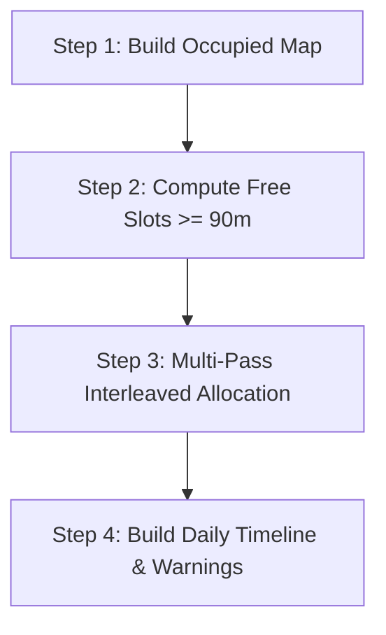

# Application Layer Reference

**Path**: `lib/features/schedule/application/`

The application layer contains the dynamic scheduling algorithm (`PlannerService`) and the reactive state management layer (`schedule_providers.dart`).

---

## Directory Structure

```
lib/features/schedule/application/
├── providers/
│   └── schedule_providers.dart # Riverpod stream providers and action delegates
└── services/
    └── planner_service.dart    # Bounded Interleaved Scheduling Engine
```

---

## PlannerService (`planner_service.dart`)

The core scheduling engine. It takes raw fixed commitments, task targets, and user deviations and produces a non-overlapping, balanced weekly timeline.

### Public API

```dart
ScheduleResult computeWeeklySchedule({
  required List<TimeBlock> fixedBlocks,
  required List<ScheduleDeviation> deviations,
  required List<TaskTarget> targets,
});
```

---

## Algorithm Step-by-Step



### Step 1: Build Occupied Map
1. Prepares a daily map `Map<int, List<TimeBlock>> allOccupied` for days 1 to 7.
2. **Process Fixed Block Cancellations**:
   - Identifies any `DeviationType.collegeCancellation` deviations.
   - If `accelerateWeek`: Filters out default recurring fixed commitments (and commute buffers) on that day.
   - If `restAndLeisure`: Replaces those fixed commitments with a single `TimeBlockType.deviation` labeled `"Free Time"` spanning the start of the first commute to the end of the last commute.
3. **Apply Standard Deviations**:
   - `DeviationType.blockout`: Added directly as an occupied block.
   - `DeviationType.extension`: Locates the referenced target block by `extendsBlockId`, extends `endMinutes`, and shifts any subsequent dependent commute buffers forward by `extensionMinutes`.
4. **Sort and Merge**:
   - Sorts each day's occupied blocks chronologically by `startMinutes`.

### Step 2: Compute Free Slots
1. Merges overlapping occupied intervals using `_mergeRanges`.
2. Computes open gaps between `kDayStartMinutes` (06:00 AM) and `kDayEndMinutes` (11:59 PM).
3. Gaps strictly shorter than `kMinBlockMinutes` (90 minutes) are discarded.
4. Returns a `Map<int, List<FreeSlot>> freeSlotsByDay`.

### Step 3: Bounded Interleaved Allocation
1. Targets are sorted in ascending priority order (`1` = highest).
2. Internal trackers (`_TargetAllocation`) track weekly accumulated minutes and daily scheduled minutes per target.
3. Multi-pass loop executes:
   ```dart
   bool madeProgress = true;
   while (madeProgress) {
     madeProgress = false;
     for (day in 1..7) {
       for (target in sortedTargets) {
         if (target.isFilled) continue;
         if (target.remainingForDay(day) <= 0) continue;

         // Partition available slots into Affinity Window vs Spillover
         affinitySlots = filterSlotsByWindow(freeSlots[day], target.affinity);
         spilloverSlots = remainingSlots;
         orderedSlots = [...affinitySlots, ...spilloverSlots];

         for (slot in orderedSlots) {
           allocated = _calculateAllocation(
             remaining: target.remainingWeekly,
             dailyRemaining: target.remainingForDay(day),
             slotDuration: slot.duration,
           );
           if (allocated < kMinBlockMinutes) continue;

           // Create Floating TimeBlock
           createFloatingBlock(target, day, slot.start, slot.start + allocated);
           slot.startMinutes += allocated;
           target.recordAllocation(day, allocated);
           madeProgress = true;
         }
       }
     }
   }
   ```

### Step 4: Result Assembly & Warning Generation
1. Combines occupied blocks with newly created floating blocks for each day.
2. Sorts each day's timeline chronologically.
3. Checks if any target failed to reach its `weeklyHours` quota. If so, creates an `AllocationWarning` specifying the exact shortfall.

---

## Result Data Structures

### `ScheduleResult`
```dart
class ScheduleResult {
  final Map<int, List<TimeBlock>> dailySchedule; // 1=Mon .. 7=Sun
  final List<AllocationWarning> warnings;        // Quota shortfalls
  final Map<String, double> allocatedHours;      // Target ID -> Actual Hours
}
```

### `AllocationWarning`
```dart
class AllocationWarning {
  final String targetId;
  final String targetName;
  final double requestedHours;
  final double allocatedHours;
  final double shortfallHours;
}
```

---

## Riverpod Providers (`schedule_providers.dart`)

The application layer exposes reactive providers that UI components consume.

```dart
// 1. Dependency Providers
final localScheduleDatasourceProvider = Provider<LocalScheduleDatasource>(...);
final scheduleRepositoryProvider = Provider<ScheduleRepository>(...);
final plannerServiceProvider = Provider<PlannerService>(...);

// 2. Main Reactive Schedule Stream
final weeklyScheduleProvider = StreamProvider<ScheduleResult>((ref) {
  // Listens to Hive watchAllChanges() and automatically recomputes
});

// 3. UI State
final selectedDayProvider = StateProvider<int>((ref) => DateTime.now().weekday);

// 4. Action Delegates
final addDeviationProvider = Provider<Future<void> Function(ScheduleDeviation)>(...);
final removeDeviationProvider = Provider<Future<void> Function(String)>(...);
final setCollegeStatusProvider = Provider<Future<void> Function(DateTime, {...})>(...);
```

### How Reactivity Operates
1. `weeklyScheduleProvider` initializes a broadcast listener on `repo.watchAllChanges()`.
2. When a user adds/removes a deviation or updates attendance, the underlying Hive box triggers an event.
3. `weeklyScheduleProvider` receives the event, triggers `recompute()`, and emits the fresh `ScheduleResult`.
4. Any listening UI widget automatically rebuilds with zero manual state refresh logic.
