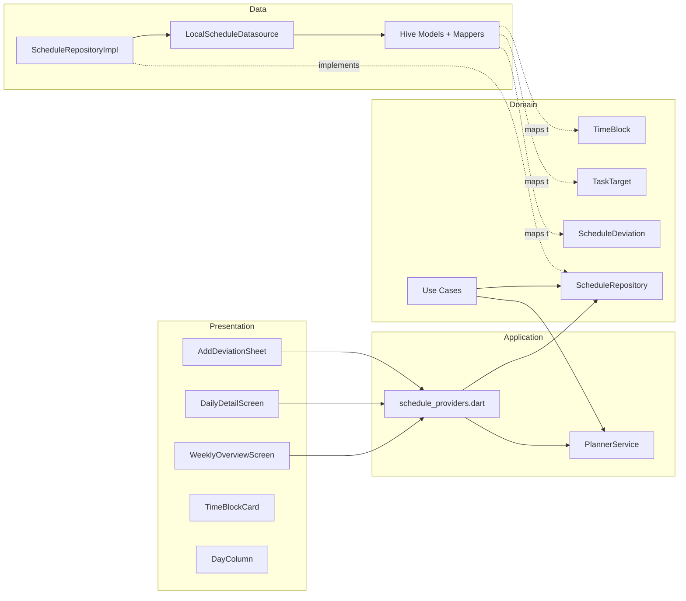

# Architecture

## Overview

Day-Date follows **Clean Architecture** with four distinct layers. Dependencies flow **inward** — outer layers know about inner layers, never the reverse.

```
┌──────────────────────────────────────────────────────┐
│  Presentation  (Flutter widgets, screens)            │
│    ↓ reads from                                      │
│  Application   (PlannerService, Riverpod providers)  │
│    ↓ depends on                                      │
│  Domain        (Entities, Repository interface,      │
│                 Use Cases — PURE DART, no Flutter)    │
│    ↑ implemented by                                  │
│  Data          (Hive models, datasource, repo impl)  │
└──────────────────────────────────────────────────────┘
```

## Layer Responsibilities

### Domain Layer (`lib/features/schedule/domain/`)

The **innermost** layer. Contains:
- **Entities**: Pure Dart value objects (`TimeBlock`, `TaskTarget`, `ScheduleDeviation`). No framework dependencies, no Hive annotations.
- **Repository Interface**: `ScheduleRepository` — an abstract class defining what data operations exist, without specifying *how* they work.
- **Use Cases**: Single-purpose classes (`SeedInitialData`, `AddDeviation`, `GetWeeklySchedule`) that orchestrate repository calls. Each use case has a single `call()` method.

**Key rule**: This layer has ZERO imports from Flutter, Hive, or Riverpod. It depends only on `equatable` for value equality.

### Data Layer (`lib/features/schedule/data/`)

Implements the domain's repository interface using Hive CE:
- **Models**: Hive-annotated classes (`TimeBlockModel`, `TaskTargetModel`, `ScheduleDeviationModel`) with generated type adapters. These are *persistence representations*, not business objects.
- **Mappers**: Bidirectional extension methods (`toEntity()` / `toModel()`) converting between domain entities and Hive models.
- **Datasource**: `LocalScheduleDatasource` — thin wrapper around Hive boxes providing typed CRUD and change stream.
- **Repository Impl**: `ScheduleRepositoryImpl` — concrete implementation of `ScheduleRepository`. Handles seed data population, college status toggling, and delegation to the datasource.

### Application Layer (`lib/features/schedule/application/`)

Contains the **core business logic** that doesn't belong in the domain (because it uses framework-specific patterns):
- **PlannerService**: The scheduling engine. Pure Dart class with a single `computeWeeklySchedule()` method. Takes raw inputs, returns a `ScheduleResult`.
- **Providers**: Riverpod providers that wire everything together reactively.

### Presentation Layer (`lib/features/schedule/presentation/`)

Flutter widgets and screens. Consumes Riverpod providers, renders the schedule, and dispatches user actions (add deviation, select day).

---

## Data Flow Lifecycle

### App Startup
```
main() → Hive.initFlutter() → registerAdapters() → openBoxes()
       → ScheduleRepositoryImpl.seedIfEmpty()
       → runApp(ProviderScope(child: DayDateApp()))
```

### Schedule Computation (Reactive)
```
weeklyScheduleProvider (StreamProvider)
  ├── Initial: calls recompute() immediately
  └── On Hive change: repo.watchAllChanges() emits → recompute()

recompute():
  1. repo.getFixedBlocks()      → List<TimeBlock>
  2. repo.getTaskTargets()      → List<TaskTarget>
  3. repo.getDeviations()       → List<ScheduleDeviation>
  4. planner.computeWeeklySchedule(blocks, deviations, targets)
  5. Emit ScheduleResult to stream → UI rebuilds
```

### User Action (Add Deviation)
```
User taps "Add Deviation" → AddDeviationSheet opens
  → User fills form, taps submit
  → ref.read(addDeviationProvider)(deviation)
  → repo.addDeviation(deviation)
  → Hive box.put() fires watch event
  → weeklyScheduleProvider re-emits → UI rebuilds with new schedule
```

### User Action (College Off)
```
User taps "College Off" → AddDeviationSheet (collegeCancellation mode)
  → User selects day + strategy
  → ref.read(addDeviationProvider)(collegeCancellationDeviation)
  → Hive box.put() fires watch event
  → PlannerService skips College/Commute blocks on that day
  → Schedule recomputes → UI rebuilds
```

---

## Hive Box Layout

| Box Name | Type | Key | Contents |
|:---------|:-----|:----|:---------|
| `fixedBlocks` | `Box<TimeBlockModel>` | block ID (UUID) | Seeded college, commute, gym blocks |
| `taskTargets` | `Box<TaskTargetModel>` | target ID (UUID) | Seeded floating targets with quotas |
| `deviations` | `Box<ScheduleDeviationModel>` | deviation ID (UUID) | User-created deviations |
| `meta` | `Box` (dynamic) | `'seeded'` | Boolean flag for first-launch detection |

---

## Dependency Graph


