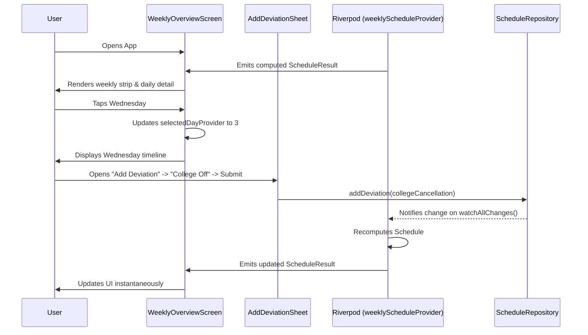

# Presentation Layer Reference

**Path**: `lib/features/schedule/presentation/`

The presentation layer contains the UI widgets, screens, and user interaction forms. It is decoupled from direct database operations and communicates strictly via Riverpod providers.

---

## Directory Structure

```
lib/features/schedule/presentation/
├── screens/
│   ├── weekly_overview_screen.dart # Main screen (weekly strip + summary + daily timeline)
│   └── daily_detail_screen.dart    # Detailed timeline list with Floating Action Button
└── widgets/
    ├── add_deviation_sheet.dart    # Modal bottom sheet form for deviations / cancellations
    ├── day_column.dart             # Mini-block day column used in the weekly strip
    └── time_block_card.dart        # Chronological timeline card with color coding
```

---

## Screens

### 1. `WeeklyOverviewScreen` (`weekly_overview_screen.dart`)

The primary home screen of the application. It watches `weeklyScheduleProvider` and `selectedDayProvider`.

```
┌──────────────────────────────────────────────┐
│  AppBar: "Day-Date"                          │
├──────────────────────────────────────────────┤
│  Weekly Strip: [Mon] [Tue] [Wed] [Thu] ...   │
├──────────────────────────────────────────────┤
│  Allocation Summary Bar (Chips & Warnings)   │
├──────────────────────────────────────────────┤
│  Daily Detail Timeline (for selected day)    │
│  - TimeBlockCard 1                           │
│  - TimeBlockCard 2                           │
│  - ...                                       │
│                                      [ + FAB]│
└──────────────────────────────────────────────┘
```

#### Key Sections:
- **Weekly Strip**: Horizontal scroll view with 7 `DayColumn` widgets representing Monday through Sunday. Tapping a column updates `selectedDayProvider`.
- **Allocation Summary (`_AllocationSummary`)**: Renders chips showing total allocated hours per target and highlights warnings if any target could not fulfill its weekly quota.
- **Embedded `DailyDetailScreen`**: Displays the full chronological schedule of the selected day.

---

### 2. `DailyDetailScreen` (`daily_detail_screen.dart`)

Displays the detailed schedule for a specific day.

#### Components:
- **Header**: Shows day title (e.g. `"Monday"`) and total number of blocks scheduled.
- **Timeline List**:
  - If empty: Shows an empty state illustration with text `"No blocks scheduled"`.
  - If populated: Renders a scrollable `ListView.builder` of `TimeBlockCard`s.
- **Floating Action Button (FAB)**:
  - Tapping opens the `AddDeviationSheet` in a modal bottom sheet.

---

## Widgets

### 1. `TimeBlockCard` (`time_block_card.dart`)

Renders an individual block in the daily timeline.

#### Visual Styling:
- **Color Coding**:
  - `TimeBlockType.fixed`: Neutral slate background and blue-grey accent bar.
  - `TimeBlockType.floating`: Categorized accent colors with soft tint background.
  - `TimeBlockType.deviation`: Highlighted red border and red background.
- **Duration Badge**: Shows formatted duration (e.g., `"1h 30m"`) on the right edge.
- **Time Format**: Displays start and end times in 12-hour AM/PM format (e.g. `10:00 AM – 11:30 AM`).

---

### 2. `DayColumn` (`day_column.dart`)

Compact vertical strip used inside the weekly overview.

#### Features:
- Displays 3-letter day abbreviation (`"Mon"`, `"Tue"`, etc.).
- Active selection styling (accent border and background tint).
- Renders up to 6 colored mini-bars (`_MiniBlock`) showing the day's density at a glance, with a `+N` badge if more than 6 blocks exist.

---

### 3. `AddDeviationSheet` (`add_deviation_sheet.dart`)

A modal bottom sheet allowing users to add overrides or cancel commitments.

#### Segmented Mode Switcher:
1. **Blockout**: User enters label, day, start time, and end time.
2. **Extension**: User enters label, day, start time, and end time.
3. **College Off (Cancellation)**:
   - Hides time pickers (operates at the full-day level).
   - Auto-labels as `"College Off"`.
   - Offers an `OffDayStrategy` selector:
     - **Accelerate Week**: Fills freed hours with study/project targets.
     - **Rest & Leisure**: Designates freed hours as unallocated leisure.
   - Computes target `DateTime` and dispatches via `addDeviationProvider`.

---

## UI State Flow


